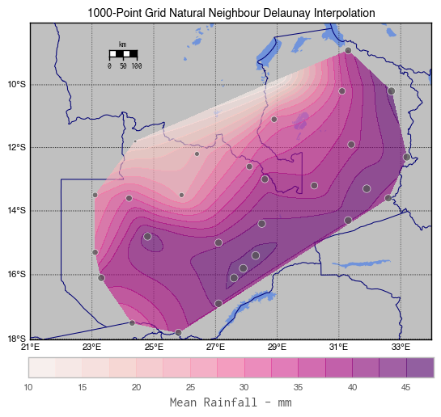
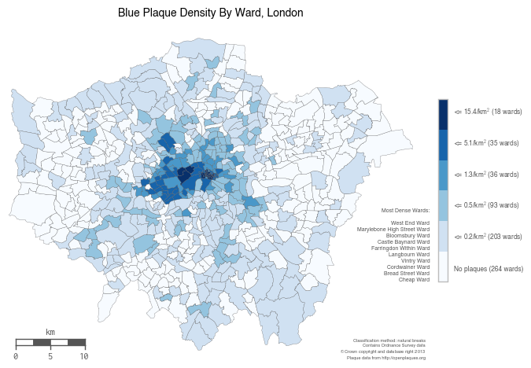

# Basic Geo and Spatial Analysis Techniques Using Python #

This is a repository of various geo/spatial analysis techniques using Python libraries, chiefly Numpy, Pandas, Shapely, Fiona, Descartes, Matplotlib, and Matplotlib-Basemap.

Note that for most users, the Enthought [Canopy](https://www.enthought.com/products/canopy/) Python distribution is probably the best way to get the required libraries (You'll have to install Folium and GeoPandas separately – they aren't included). However, feel free to install the libraries manually using `requirements.txt` if you know what you're doing, in which case you'll also need various compilers (GCC, Fortran), and libraries (GDAL, GEOS). The use of a [virtualenv](http://virtualenv.readthedocs.org/en/latest/) is advised.

Note that unless otherwise specified, the [wards.geojson](wards.geojson) file and any shapefiles are provided under
[Crown Copyright](http://www.nationalarchives.gov.uk/information-management/re-using-public-sector-information/copyright/crown-copyright/), and their use must be acknowledged in any output by reproducing the following notice:

`Contains Ordnance Survey data  
© Crown copyright and database right 2014`

Unless otherwise specified, all other files are provided under the [MIT License](LICENSE.txt).

## The Notebooks

[Convert](http://nbviewer.ipython.org/github/urschrei/Geopython/blob/master/convert.ipynb): demonstrates point, choropleth, and hexbin mapping techniques using pandas and Matplotlib Basemap  

[Convert_Folium](http://nbviewer.ipython.org/github/urschrei/Geopython/blob/master/convert_folium.ipynb): demonstrates the use of the [Folium](https://github.com/wrobstory/folium) library for creating web-based maps from Python data (pandas) using [Leaflet](http://leafletjs.com) to generate a choropleth map

[Contour](http://nbviewer.ipython.org/github/urschrei/Geopython/blob/master/contour.ipynb): demonstrates interpolation of irregularly-spaced point data (mean rainfall) into a regular grid, calculating a contour plot, and imposing it onto a basemap (see graphic above). I then compare two approaches for generating surfaces – Delaunay Natural Neighbour (`matplotlib.griddata`), and refinement of a coarse Delaunay mesh using `matplotlib.UniformTriRefiner`, which uses recursive subdivision and cubic interpolation. High-res images are available in the [data](data) folder, all beginning with `rainfall_`.

[Plaques_Geopandas](http://nbviewer.ipython.org/github/urschrei/Geopython/blob/master/plaques_geopandas.ipynb): demonstrates [Geopandas](http://geopandas.org) and its spatial join functionality, used to create a choropleth.

