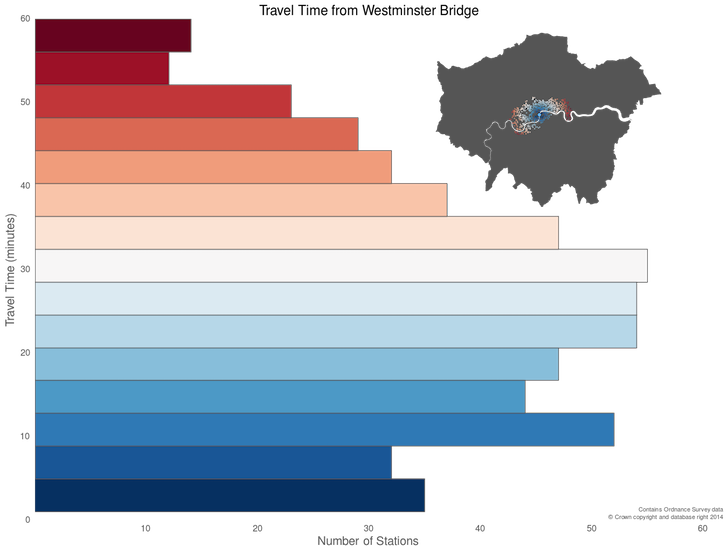
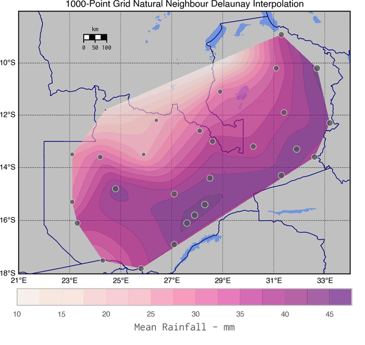
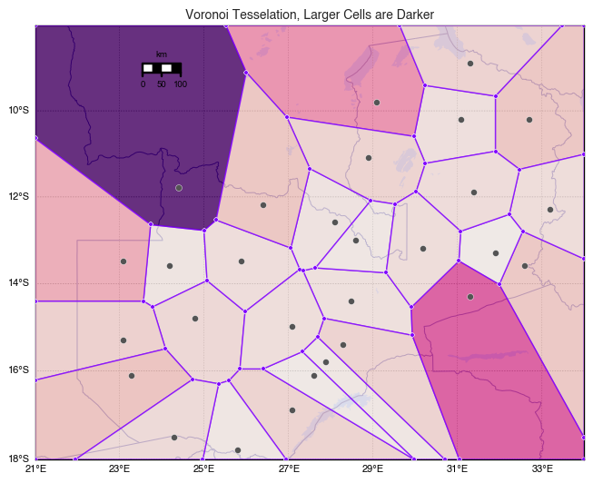
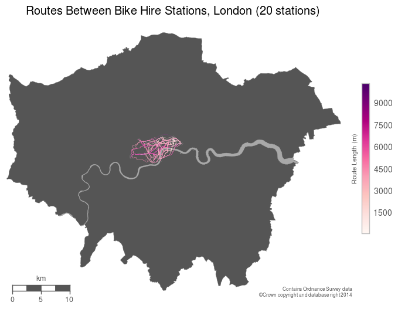
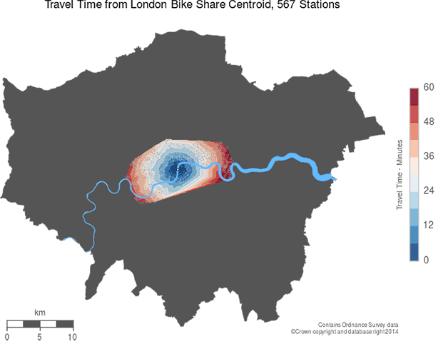
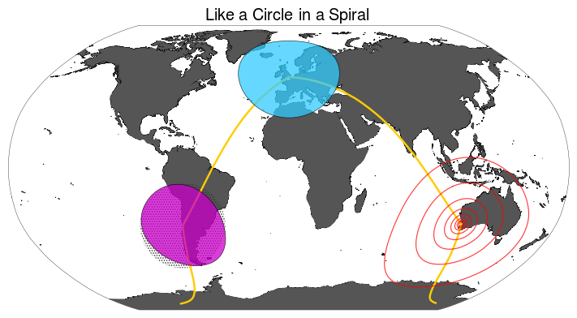

## Geocomputation, Cartography, and Spatial Analysis Techniques Using Python

This is a repository of various geo/spatial analysis techniques using Python libraries, chiefly Numpy, Pandas, Shapely, Fiona, Descartes, Matplotlib, and Matplotlib-Basemap.

I'm working on these notebooks, tutorials, and libraries while embroiled in a PhD at the [Bartlett Centre for Advanced Spatial Analysis](http://www.bartlett.ucl.ac.uk/casa), at [UCL](http://www.ucl.ac.uk).

### The Notebooks

[Convert](http://nbviewer.ipython.org/github/urschrei/Geopython/blob/master/convert.ipynb): demonstrates point, choropleth, and hexbin mapping techniques using pandas and Matplotlib Basemap  

[Convert_Folium](http://nbviewer.ipython.org/github/urschrei/Geopython/blob/master/convert_folium.ipynb): demonstrates the use of the [Folium](https://github.com/wrobstory/folium) library for creating web-based maps from Python data (pandas) using [Leaflet](http://leafletjs.com) to generate a choropleth map

[WLS](http://nbviewer.ipython.org/urls/raw.github.com/urschrei/linalg/master/notebooks/weighted_least_squares.ipynb): demonstrates the use of weighted least-squares estimation of similarity and affine transforms to calculate parameters for a transformation matrix which can be used to transform and align coordinates. This approach is useful for e.g. georeferencing raster data, and map feature alignment and correction.

[Contour](http://nbviewer.ipython.org/github/urschrei/Geopython/blob/master/contour.ipynb): demonstrates interpolation of irregularly-spaced point data (mean rainfall) into a regular grid, calculating a contour plot, and imposing it onto a basemap (see graphic below). Two approaches for calculating continuous surfaces are then compared – Delaunay Natural Neighbour (`matplotlib.griddata`), and refinement of a coarse Delaunay mesh using `matplotlib.UniformTriRefiner`, which uses recursive subdivision and cubic interpolation. High-res images are available in the [data](data) folder, all beginning with `rainfall_`. :umbrella::umbrella::umbrella:  
Finally, the map is partitioned into *clipped* Voronoi cells based on the sensor locations, and some plotting methods (more flexible than `scipy.spatial.voronoi2d`) are shown.  

[Bikepath](http://nbviewer.ipython.org/github/urschrei/Geopython/blob/master/bikepath.ipynb): takes a subset of London bicycle hire stations, creates a DataFrame of all possible origin and destination pairs, and then uses MapZen's wonderful [open OSRM endpoint](https://mapzen.com/blog/osrm-services) to get valid bicycle routes between them. These routes are then plotted (it's just the first 400 – there are over 490k origin / destination pairs in total) on a map.

[Isochrone](http://nbviewer.ipython.org/github/urschrei/Geopython/blob/master/isochrone.ipynb): an [isochrone](http://en.wikipedia.org/wiki/Isochrone_map) is computed for the complete London bike network from an origin at its centroid. Given a network of stations, [Single-Source Shortest Path Length](https://networkx.github.io/documentation/latest/reference/algorithms.shortest_paths.html), weighted by the travel time between the origin and destinations can be used to generate travel times – though this isn't necessary for a single origin.

[Plaques_Geopandas](http://nbviewer.ipython.org/github/urschrei/Geopython/blob/master/plaques_geopandas.ipynb): demonstrates [Geopandas](http://geopandas.org) and its spatial join functionality, used to create a choropleth.

[Circles](http://nbviewer.ipython.org/github/urschrei/Geopython/blob/master/circles.ipynb): demonstrates drawing circles with correct distortion characteristics on a map (the dot-shaded circle is erroneously non-distorted). The helper library used to plot the circles is available [here](https://github.com/urschrei/Circles).

---
### Installation and usage

Note that for most users, the Enthought [Canopy](https://www.enthought.com/products/canopy/) Python distribution is probably the best way to get the required libraries (You'll have to install Folium and GeoPandas separately – they aren't included). However, feel free to install the libraries manually using `requirements.txt` if you know what you're doing, in which case you'll also need various compilers (GCC, Fortran), and libraries (GDAL, GEOS). The use of a [virtualenv](http://virtualenv.readthedocs.org/en/latest/) is advised.

### License  
© Stephan Hügel 2014  

Unless otherwise specified, the [wards.geojson](wards.geojson) file and any UK shapefiles are provided under
[Crown Copyright](http://www.nationalarchives.gov.uk/information-management/re-using-public-sector-information/copyright/crown-copyright/), and their use must be acknowledged in any output by reproducing the following notice:

`Contains Ordnance Survey data  
© Crown copyright and database right 2014`

Unless otherwise specified, all other files are provided under the [Creative Commons Attribution-NonCommercial-ShareAlike 4.0 International](http://creativecommons.org/licenses/by-nc-sa/4.0/) license.  

